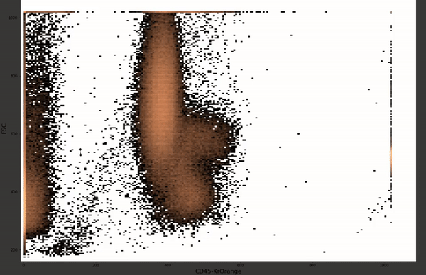
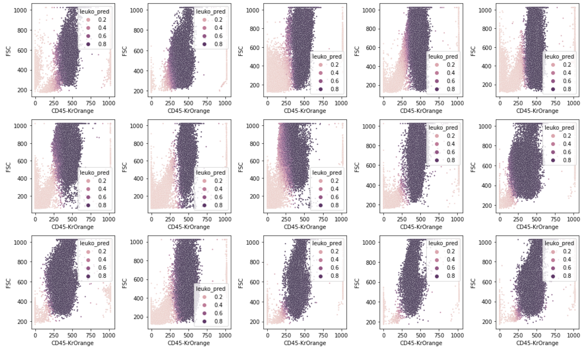
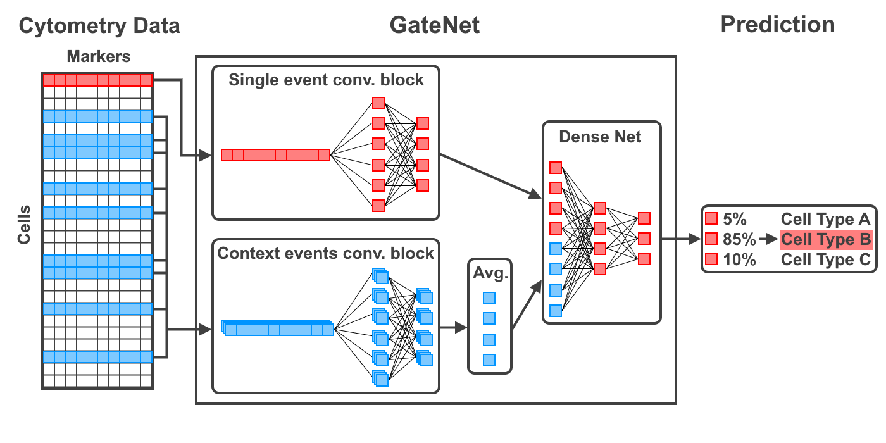

# GateNet
This is the official implementation of the [GateNet paper]([https://arxiv.org/abs/2312.07316]).

## Tutorials
There are two tutorials which can serve as a starting point for your own analysis.

1. [FlowCAP Data Tutorial](tutorials/flowcap_data.ipynb): Model training + validation (cross validation) of GateNet with existing gates using the Normal Donors (ND) dataset published during the [FlowCAP I challenge](https://www.nature.com/articles/nmeth.2365).

2. [Custom Data Tutorial](tutorials/custom_data.ipynb): Model training and automated gating + creation of training data (i.e. manual gating) for custom data using [FlowCytometryTools](https://github.com/eyurtsev/FlowCytometryTools).
This way, manual gating, model training and prediction with custom data is possible within one Jupyter notebook!

## Why GateNet?
GateNet is a neural network architecture which is specifically designed for automated flow cytometry gating.

### Introduction

Flow cytometry (FC) is an analytical technique which is used to **identify cell types**. 
Inputted with a sample (e.g. blood) containing cells, it **sequentially measures** each cells individual light scatter and fluorescence emission properties.
The cell identification is typically done manually based on 2D scatter plots of the resulting measurements of all cells in the probe.
In manual gating, the scatter points (i.e. cell measurements) are partitioned (’gated’) upon visual inspection.
### Manual Gating
Here, traditional manual gating (of leukocytes i.e. population in the center) of three samples is shown:



As shown, gates have to be set individually for each sample which is both **time consuming and subjectiv**.
Nonetheless, it is inevitable since the distribution of scatter points varies due to measurement variance between samples (’batch effect’).

### Automated Gating (with GateNet)
Gating can be automated using a GateNet which was trained with gated samples.

As shown in the [Tutorial](tutorials/custom_data.ipynb) GateNet can be trained with only 5 training samples.
Since it is implemented in PyTorch, training and prediction can be GPU-accelerated such that automated gating only takes seconds.
These are the **results of the automated gating** (with only 5 training samples) on 20 unseen samples:



### Method

GateNets key feature is to take into account the context of measurements alongside a single cell/event measurement. 
So, to predict the class/type of a single cell the neural network is feed with the single event measurement + (ca. 1000) event measurements of the respective sample.  

This allows it to **autonomously correct for batch effects** as it "sees the scatter plot" not just the single scatter point!



## Installation

### 0. Install Anaconda (if you haven't already)
First, [Anaconda](https://www.anaconda.com/products/distribution) or [Miniconda](https://docs.conda.io/en/latest/miniconda.html) should be installed 

### 1. Create new conda environment
```bash
conda create -n gatenet python=3.9
conda activate gatenet
```
### 2. Install dependencies
```bash
conda install -c conda-forge mamba
mamba install -c fastchan fastai anaconda
mamba install -c bioconda fcsparser
mamba install -c conda-forge pyarrow
mamba install -c anaconda seaborn
```

### 3. Install gatenet
```bash
pip install git+https://github.com/wwu-mmll/gatenet@main
```
## Citation
If you find this code useful in your research, please consider citing:

    @inproceedings{gatenet,
    Lukas Fisch, Michael O. Heming, Andreas Schulte-Mecklenbeck, Catharina C. Gross, Stefan Zumdick, Carlotta Barkhau, Daniel Emden, Jan Ernsting, Ramona Leenings, Kelvin Sarink, Nils R. Winter, Udo Dannlowski, Heinz Wiendl, Gerd Meyer zu Hörste, Tim Hahn},
    Title = {GateNet: A novel Neural Network Architecture for Automated Flow Cytometry Gating},
    Year = {2023}
    }
